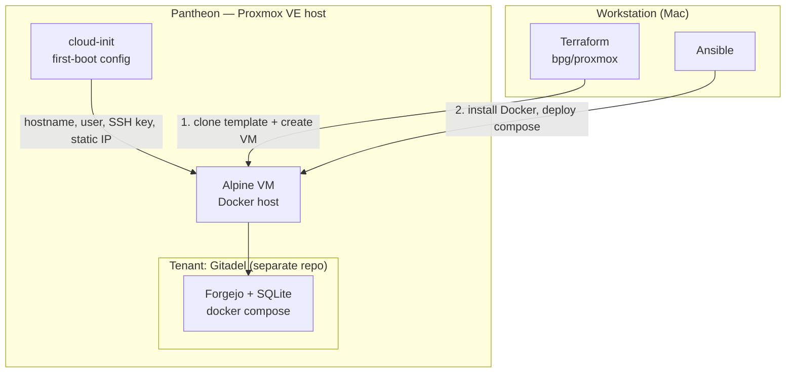

# Pantheon — Homelab-as-Code

Infrastructure-as-Code for **Pantheon**, a single-node [Proxmox VE](https://www.proxmox.com/)
homelab hypervisor. This repo provisions and configures the platform — and its first
tenant, a self-hosted [Forgejo](https://forgejo.org/) git forge — entirely from code:
no VMs clicked together by hand.

Motivation is **data sovereignty** (self-host what matters) and **reproducibility**
(the whole platform rebuilds from this repo). The running services stay private; the
*recipe to build them* is public.


## Architecture

Pantheon owns only the **platform** (Proxmox-specific). Each service is a separate,
vendor-neutral repo that must run on any Docker host — a strict host↔tenant split.



**Lifecycle of a VM:** cloud-init initializes the guest on first boot → Terraform
creates it → Ansible configures it. Terraform *provisions* infrastructure; Ansible
*configures* it; cloud-init *bootstraps* it.


## Repository layout:

```
pantheon-iac/
├── README.md            # this file
├── docs/
│   └── host-runbook.md  # manual host foundation (topology scrubbed)
├── terraform/           # provider auth + VM resources + variables
├── ansible/             # inventory + roles (docker-host base, deploy seam)
├── cloud-init/          # first-boot guest template build
├── .env.example         # variable names only — copy to .env (gitignored)
└── .gitignore           # tfstate, tfvars, .env, keys
```


## Secrets & topology — never in git

- Terraform secrets (Proxmox API token, SSH pubkey, static IP) live in
  `terraform.tfvars` (gitignored) or `TF_VAR_*` env vars.
- Service secrets live on the VM in a gitignored `.env`; only `.env.example` is committed.
- Home-network topology (IPs, hostnames) is parameterized via variables — the public
  repo ships placeholders, never real values.


## Status

**v0.1 — in progress**, built phase-by-phase (repo skeleton → Proxmox auth → Alpine
template → declare VM → Ansible deploy → backups & reproducibility → publish). Local
Terraform state; LAN-only; remote access deferred.


## Prerequisites

- A Proxmox VE host reachable over the LAN (see [`docs/host-runbook.md`](docs/host-runbook.md)).
- [Terraform](https://developer.hashicorp.com/terraform) and
  [Ansible](https://docs.ansible.com/) installed on the workstation.
